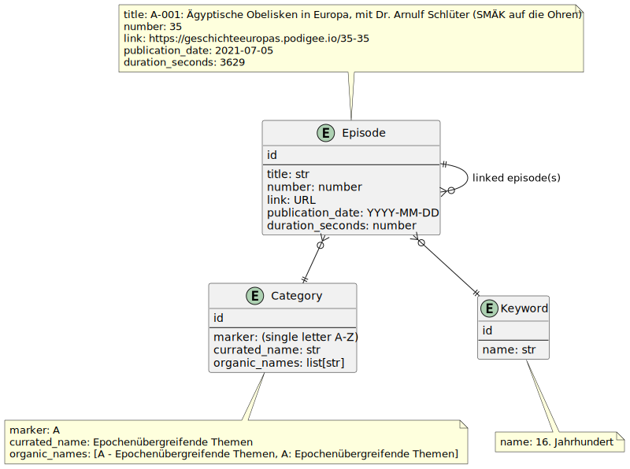

# Readme

## Database layout

- prerequistes

    ```sh
    sudo apt install openjdk-11-jdk
    ```

- generate plots (from root folder)

    ```sh
    java -jar 3rd/plantuml-1.2023.7.jar -tsvg  db/layout/db-erd.plantuml
    ```


